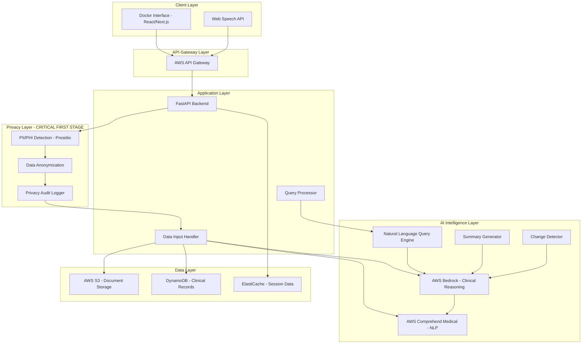
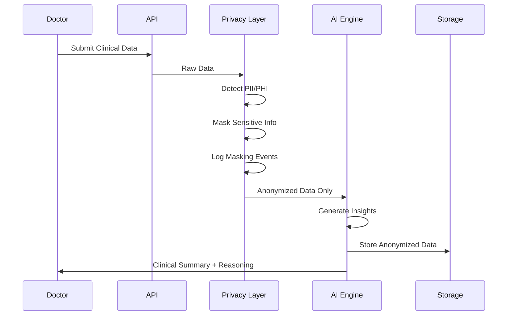

# Design Document: VAIDYAMITRA 

## Overview

VAIDYAMITRA -  AI is a privacy-preserving clinical intelligence system that enhances doctor efficiency through AI-powered analysis of patient data. The system employs a multi-layered architecture with privacy protection as the foundational layer, ensuring all sensitive information is anonymized before any AI processing occurs.

The system integrates multiple AI services (AWS Bedrock for reasoning, AWS Comprehend Medical for clinical NLP, Microsoft Presidio for PII detection) to provide semantic clinical summarization, temporal change detection, and natural language query capabilities. The architecture is designed for scalability across individual clinics, hospitals, and telemedicine platforms.

**Key Design Principles:**
- Privacy-first architecture with mandatory PII/PHI masking
- Real AI reasoning (not rule-based) for clinical intelligence
- Decision-support only (no diagnosis or treatment)
- Explainable AI with transparent reasoning
- Human-in-the-loop approach
- Scalable cloud-native design

## Architecture

### High-Level Architecture



### Privacy-First Data Flow



## Components and Interfaces

### 1. Privacy Layer

**Purpose:** Detect and mask all PII/PHI before any AI processing occurs.

**Components:**
- **PII Detector**: Uses Microsoft Presidio to identify sensitive information
- **Anonymizer**: Replaces PII/PHI with tokens while preserving clinical context
- **Privacy Audit Logger**: Records all detection and masking operations

**Key Interfaces:**

```python
class PrivacyLayer:
    def detect_and_mask(self, raw_data: str) -> AnonymizedData:
        """
        Detects PII/PHI and returns anonymized data.
        Raises PrivacyException if masking fails.
        """
        pass
    
    def get_entity_types(self) -> List[str]:
        """Returns list of detected entity types (PERSON, PHONE, MRN, etc.)"""
        pass
    
    def audit_log(self, event: PrivacyEvent) -> None:
        """Logs privacy-related events for compliance"""
        pass

class AnonymizedData:
    masked_text: str
    entity_map: Dict[str, str]  # Original token -> Masked token
    confidence_scores: Dict[str, float]
    timestamp: datetime
```

**Privacy Detection Rules:**
- Names (PERSON)
- Phone numbers (PHONE_NUMBER)
- Medical record numbers (MEDICAL_RECORD_NUMBER)
- Insurance IDs (INSURANCE_ID)
- Dates of birth (DATE_OF_BIRTH)
- Addresses (LOCATION)
- Email addresses (EMAIL)
- Social security numbers (SSN)

**Masking Strategy:**
- Consistent tokenization: Same PII always maps to same token within session
- Context preservation: "Dr. Smith" → "Dr. [PHYSICIAN_1]"
- Clinical relevance: Preserve medical terms, mask only identifiers

### 2. Data Input Handler

**Purpose:** Process multiple input formats and route to appropriate parsers.

**Components:**
- **Manual Entry Processor**: Handles text input from doctors
- **PDF Extractor**: Uses OCR/text extraction for medical reports
- **JSON Parser**: Processes structured clinical data
- **HL7 Parser**: Handles HL7 v2.x messages (simulation support)

**Key Interfaces:**

```python
class DataInputHandler:
    def process_input(self, input_data: InputData) -> ProcessedClinicalData:
        """Routes input to appropriate processor based on format"""
        pass
    
    def validate_clinical_data(self, data: ProcessedClinicalData) -> ValidationResult:
        """Validates data structure and medical terminology"""
        pass

class InputData:
    format: InputFormat  # MANUAL, PDF, JSON, HL7
    content: bytes | str
    metadata: Dict[str, Any]

class ProcessedClinicalData:
    patient_id: str  # Anonymized
    visit_date: datetime
    chief_complaint: Optional[str]
    history: Optional[str]
    lab_results: List[LabResult]
    medications: List[Medication]
    vitals: Optional[VitalSigns]
    notes: Optional[str]
```

### 3. Clinical Intelligence Engine

**Purpose:** Generate AI-powered clinical insights using semantic understanding.

**Components:**
- **Summary Generator**: Creates concise clinical summaries
- **Change Detector**: Identifies temporal changes across visits
- **Trend Analyzer**: Detects progression patterns
- **Reasoning Explainer**: Provides transparent reasoning for insights

**Key Interfaces:**

```python
class ClinicalIntelligenceEngine:
    def __init__(self, bedrock_client, comprehend_client):
        self.bedrock = bedrock_client
        self.comprehend = comprehend_client
    
    def generate_summary(self, clinical_data: ProcessedClinicalData) -> ClinicalSummary:
        """Generates AI-powered clinical summary with reasoning"""
        pass
    
    def detect_changes(self, current_visit: ProcessedClinicalData, 
                      previous_visits: List[ProcessedClinicalData]) -> ChangeReport:
        """Identifies significant changes between visits"""
        pass
    
    def analyze_trends(self, visits: List[ProcessedClinicalData]) -> TrendAnalysis:
        """Detects progression patterns across multiple visits"""
        pass

class ClinicalSummary:
    summary_text: str
    key_findings: List[Finding]
    clinical_context: str
    reasoning: List[ReasoningStep]
    confidence: float
    generated_at: datetime

class Finding:
    category: str  # CONDITION, SYMPTOM, LAB_ABNORMALITY, MEDICATION_CHANGE
    description: str
    severity: str  # CRITICAL, IMPORTANT, MINOR
    supporting_data: List[str]
    reasoning: str

class ChangeReport:
    significant_changes: List[Change]
    stable_conditions: List[str]
    new_findings: List[Finding]
    resolved_issues: List[str]
    overall_assessment: str

class Change:
    category: str
    description: str
    severity: str  # CRITICAL, IMPORTANT, MINOR
    previous_value: Optional[str]
    current_value: str
    trend_direction: str  # IMPROVING, WORSENING, STABLE
    reasoning: str
```

**AI Integration Strategy:**

**AWS Bedrock (Primary Reasoning Engine):**
- Model: Claude 3 Sonnet or Claude 3.5 Sonnet
- Use for: Clinical reasoning, summary generation, change detection
- Prompt engineering: Structured prompts with clinical context
- Temperature: 0.3 (balanced creativity and consistency)

**AWS Comprehend Medical:**
- Entity extraction: Conditions, medications, dosages, procedures
- Relationship detection: Medication-condition links
- Ontology linking: ICD-10, RxNorm, SNOMED CT
- Use for: Structured data extraction from unstructured text

**Prompt Template for Clinical Summary:**
```
You are a clinical intelligence assistant helping doctors understand patient data.

Patient Clinical Data (Anonymized):
{anonymized_clinical_data}

Task: Generate a concise clinical summary focusing on:
1. Current clinical status
2. Key findings requiring attention
3. Relevant medical history

Requirements:
- Be concise (max 200 words)
- Highlight critical information
- Use medical terminology appropriately
- Provide reasoning for each key finding
- Indicate confidence level

Format your response as JSON:
{
  "summary": "...",
  "key_findings": [...],
  "reasoning": [...]
}
```

### 4. Voice Query System

**Purpose:** Enable hands-free interaction through voice commands.

**Components:**
- **Speech Recognizer**: Web Speech API integration
- **Query Parser**: NLP for intent and entity extraction
- **Response Generator**: Natural language response creation
- **Audio Feedback**: Text-to-speech for confirmations

**Key Interfaces:**

```python
class VoiceQuerySystem:
    def transcribe_audio(self, audio_stream: AudioStream) -> str:
        """Converts speech to text using Web Speech API"""
        pass
    
    def parse_query(self, transcribed_text: str) -> QueryIntent:
        """Extracts intent and entities from natural language"""
        pass
    
    def generate_response(self, query_intent: QueryIntent, 
                         clinical_context: ClinicalContext) -> QueryResponse:
        """Generates contextually relevant response"""
        pass

class QueryIntent:
    intent_type: str  # SUMMARIZE, CHANGES, SPECIFIC_VALUE, TREND
    entities: Dict[str, str]  # {entity_type: entity_value}
    temporal_context: Optional[str]  # "since last visit", "over 3 months"
    confidence: float

class QueryResponse:
    response_text: str
    supporting_data: List[str]
    reasoning: str
    confidence: float
    follow_up_suggestions: List[str]
```

**Supported Query Patterns:**
- "What changed since last visit?"
- "Summarize key concerns"
- "Show me lab trends for [test name]"
- "Any medication changes?"
- "What's the current status of [condition]?"

### 5. Doctor Interface (Frontend)

**Purpose:** Provide simplified, doctor-friendly clinical view.

**Technology Stack:**
- Framework: Next.js 14 with App Router
- Styling: Tailwind CSS
- State Management: React Context + TanStack Query
- Voice: Web Speech API
- Charts: Recharts for trend visualization

**Key Views:**

**Dashboard Layout:**
```
┌─────────────────────────────────────────────────┐
│  VAIDYAMITRA - ClinGuard AI                     │
│  [Voice Input 🎤] [Patient: [PATIENT_1]]        │
├─────────────────────────────────────────────────┤
│                                                  │
│  ┌─────────────────────────────────────────┐   │
│  │  WHAT CHANGED                            │   │
│  │  🔴 Critical: HbA1c increased to 9.2%    │   │
│  │  🟡 Important: New medication added      │   │
│  │  🟢 Minor: Weight stable                 │   │
│  └─────────────────────────────────────────┘   │
│                                                  │
│  ┌─────────────────────────────────────────┐   │
│  │  CLINICAL SNAPSHOT                       │   │
│  │  Patient presents with uncontrolled      │   │
│  │  diabetes. Recent labs show elevated...  │   │
│  │  [Expand for full summary]               │   │
│  └─────────────────────────────────────────┘   │
│                                                  │
│  ┌─────────────────────────────────────────┐   │
│  │  AI REASONING                            │   │
│  │  HbA1c trend: 7.8% → 8.5% → 9.2%        │   │
│  │  Reasoning: Progressive increase over    │   │
│  │  3 visits suggests inadequate control... │   │
│  │  [View detailed reasoning]               │   │
│  └─────────────────────────────────────────┘   │
│                                                  │
└─────────────────────────────────────────────────┘
```

**Component Structure:**

```typescript
// Main Dashboard Component
interface DashboardProps {
  patientId: string;
}

const Dashboard: React.FC<DashboardProps> = ({ patientId }) => {
  const { data: summary } = useClinicalSummary(patientId);
  const { data: changes } = useChangeDetection(patientId);
  
  return (
    <div className="dashboard">
      <VoiceInput onQuery={handleVoiceQuery} />
      <ChangesSummary changes={changes} />
      <ClinicalSnapshot summary={summary} />
      <ReasoningExplainer reasoning={summary?.reasoning} />
    </div>
  );
};

// Voice Input Component
interface VoiceInputProps {
  onQuery: (query: string) => void;
}

const VoiceInput: React.FC<VoiceInputProps> = ({ onQuery }) => {
  const { isListening, transcript, startListening } = useVoiceRecognition();
  
  return (
    <button onClick={startListening}>
      {isListening ? '🎤 Listening...' : '🎤 Ask a question'}
    </button>
  );
};
```

### 6. Backend API (FastAPI)

**Purpose:** Orchestrate all system components and provide RESTful API.

**Key Endpoints:**

```python
from fastapi import FastAPI, UploadFile, HTTPException
from pydantic import BaseModel

app = FastAPI(title="ClinGuard AI API")

# Privacy-protected data submission
@app.post("/api/v1/clinical-data")
async def submit_clinical_data(data: ClinicalDataInput) -> ClinicalDataResponse:
    """
    Accepts clinical data, applies privacy layer, stores anonymized data.
    Returns anonymized patient ID and confirmation.
    """
    pass

# Generate clinical summary
@app.get("/api/v1/summary/{patient_id}")
async def get_clinical_summary(patient_id: str) -> ClinicalSummary:
    """
    Generates AI-powered clinical summary for patient.
    Requires anonymized patient ID.
    """
    pass

# Detect changes between visits
@app.get("/api/v1/changes/{patient_id}")
async def get_changes(patient_id: str, since_visit: Optional[str] = None) -> ChangeReport:
    """
    Identifies significant changes since previous visit or specified date.
    """
    pass

# Process voice query
@app.post("/api/v1/query")
async def process_query(query: VoiceQuery) -> QueryResponse:
    """
    Processes natural language query and returns AI-generated response.
    """
    pass

# Upload medical report
@app.post("/api/v1/upload-report")
async def upload_report(file: UploadFile, patient_id: str) -> UploadResponse:
    """
    Accepts PDF medical report, extracts clinical data, applies privacy layer.
    """
    pass

# Health check
@app.get("/api/v1/health")
async def health_check() -> HealthStatus:
    """Returns system health status including privacy layer status"""
    pass
```

## Data Models

### Core Data Structures

```python
from datetime import datetime
from typing import List, Optional, Dict, Any
from pydantic import BaseModel, Field
from enum import Enum

# Enums
class InputFormat(str, Enum):
    MANUAL = "manual"
    PDF = "pdf"
    JSON = "json"
    HL7 = "hl7"

class Severity(str, Enum):
    CRITICAL = "critical"
    IMPORTANT = "important"
    MINOR = "minor"

class TrendDirection(str, Enum):
    IMPROVING = "improving"
    WORSENING = "worsening"
    STABLE = "stable"

# Patient and Visit Models
class VitalSigns(BaseModel):
    blood_pressure_systolic: Optional[int]
    blood_pressure_diastolic: Optional[int]
    heart_rate: Optional[int]
    temperature: Optional[float]
    respiratory_rate: Optional[int]
    oxygen_saturation: Optional[float]
    weight: Optional[float]
    height: Optional[float]
    bmi: Optional[float]

class LabResult(BaseModel):
    test_name: str
    value: float | str
    unit: str
    reference_range: Optional[str]
    abnormal_flag: Optional[bool]
    test_date: datetime

class Medication(BaseModel):
    name: str
    dosage: str
    frequency: str
    route: str
    start_date: Optional[datetime]
    end_date: Optional[datetime]
    indication: Optional[str]

class ClinicalVisit(BaseModel):
    visit_id: str
    patient_id: str  # Anonymized
    visit_date: datetime
    visit_type: str  # ROUTINE, FOLLOW_UP, EMERGENCY
    chief_complaint: Optional[str]
    history_of_present_illness: Optional[str]
    past_medical_history: Optional[str]
    medications: List[Medication]
    allergies: List[str]
    vitals: Optional[VitalSigns]
    lab_results: List[LabResult]
    assessment: Optional[str]
    plan: Optional[str]
    notes: Optional[str]
    created_at: datetime
    updated_at: datetime

# Privacy Models
class PrivacyEvent(BaseModel):
    event_id: str
    event_type: str  # DETECTION, MASKING, ACCESS
    timestamp: datetime
    user_id: Optional[str]
    entities_detected: List[str]
    confidence_scores: Dict[str, float]
    action_taken: str

class AnonymizedData(BaseModel):
    masked_text: str
    entity_map: Dict[str, str]
    confidence_scores: Dict[str, float]
    timestamp: datetime
    privacy_events: List[PrivacyEvent]

# AI Intelligence Models
class ReasoningStep(BaseModel):
    step_number: int
    description: str
    supporting_data: List[str]
    confidence: float

class Finding(BaseModel):
    finding_id: str
    category: str  # CONDITION, SYMPTOM, LAB_ABNORMALITY, MEDICATION_CHANGE
    description: str
    severity: Severity
    supporting_data: List[str]
    reasoning: str
    confidence: float

class ClinicalSummary(BaseModel):
    summary_id: str
    patient_id: str
    visit_id: str
    summary_text: str
    key_findings: List[Finding]
    clinical_context: str
    reasoning: List[ReasoningStep]
    confidence: float
    generated_at: datetime
    model_version: str

class Change(BaseModel):
    change_id: str
    category: str
    description: str
    severity: Severity
    previous_value: Optional[str]
    current_value: str
    trend_direction: TrendDirection
    reasoning: str
    confidence: float

class ChangeReport(BaseModel):
    report_id: str
    patient_id: str
    current_visit_id: str
    comparison_visit_id: str
    significant_changes: List[Change]
    stable_conditions: List[str]
    new_findings: List[Finding]
    resolved_issues: List[str]
    overall_assessment: str
    generated_at: datetime

class TrendAnalysis(BaseModel):
    analysis_id: str
    patient_id: str
    metric_name: str
    time_period: str
    data_points: List[Dict[str, Any]]
    trend_direction: TrendDirection
    statistical_significance: float
    clinical_interpretation: str
    reasoning: str

# Query Models
class QueryIntent(BaseModel):
    intent_type: str  # SUMMARIZE, CHANGES, SPECIFIC_VALUE, TREND
    entities: Dict[str, str]
    temporal_context: Optional[str]
    confidence: float

class QueryResponse(BaseModel):
    response_id: str
    query_text: str
    response_text: str
    supporting_data: List[str]
    reasoning: str
    confidence: float
    follow_up_suggestions: List[str]
    generated_at: datetime
```

### Database Schema (DynamoDB)

**Table: ClinicalVisits**
- Partition Key: `patient_id` (anonymized)
- Sort Key: `visit_date`
- Attributes: All fields from ClinicalVisit model
- GSI: `visit_id-index` for direct visit lookup

**Table: ClinicalSummaries**
- Partition Key: `patient_id`
- Sort Key: `summary_id`
- Attributes: All fields from ClinicalSummary model
- TTL: Optional expiration for temporary summaries

**Table: PrivacyAuditLog**
- Partition Key: `event_date` (YYYY-MM-DD)
- Sort Key: `timestamp`
- Attributes: All fields from PrivacyEvent model
- Retention: 7 years for compliance

**Table: ChangeReports**
- Partition Key: `patient_id`
- Sort Key: `report_id`
- Attributes: All fields from ChangeReport model

### Storage Strategy

**AWS S3 Buckets:**
- `clinguard-medical-reports`: Uploaded PDF reports (encrypted at rest)
- `clinguard-anonymized-data`: Processed anonymized clinical data
- `clinguard-audit-logs`: Long-term audit log storage

**ElastiCache (Redis):**
- Session data for active doctor sessions
- Cached clinical summaries (TTL: 1 hour)
- Voice query context (TTL: 30 minutes)

## Correctness Properties

*A property is a characteristic or behavior that should hold true across all valid executions of a system—essentially, a formal statement about what the system should do. Properties serve as the bridge between human-readable specifications and machine-verifiable correctness guarantees.*

Before defining the correctness properties, I need to analyze each acceptance criterion for testability.


### Property Reflection

After analyzing all acceptance criteria, I've identified the following redundancies and consolidations:

**Redundancies Identified:**
1. Properties 1.1, 9.1, and 9.2 all test that privacy layer runs first - can be consolidated
2. Properties 4.2 and 10.5 both test trend detection - can be combined
3. Properties 10.1, 10.2, and 10.3 all test multi-visit context - can be consolidated
4. Properties 7.1, 7.2, and 7.4 all test that insights have required metadata - can be combined
5. Properties 2.1, 2.2, 2.3, 2.4 all test input format handling - these are distinct enough to keep separate but can be grouped
6. Properties 15.1, 15.2, and 15.3 all test audit logging - can be consolidated into one comprehensive property

**Consolidation Strategy:**
- Combine privacy-first execution properties into one comprehensive property
- Merge trend detection properties across single and multiple visits
- Consolidate multi-visit context properties into one property
- Combine insight metadata properties (reasoning, data, confidence) into one
- Keep input format properties separate as they test different parsers
- Merge all audit logging properties into one comprehensive property

### Correctness Properties

Property 1: Privacy Layer First Execution
*For any* clinical data input, the Privacy Layer must complete PII/PHI detection and masking before any other system component (including the AI engine) receives the data, and if the Privacy Layer fails, all processing must be rejected.
**Validates: Requirements 1.1, 1.3, 9.1, 9.2, 9.3**

Property 2: PII/PHI Masking Performance
*For any* clinical data containing PII or PHI, the Privacy Layer must detect and mask all sensitive information within 100 milliseconds.
**Validates: Requirements 1.2**

Property 3: Comprehensive PII Detection
*For any* clinical data containing names, phone numbers, medical record numbers, insurance IDs, addresses, emails, or SSNs, the Privacy Layer must replace all instances with anonymized tokens.
**Validates: Requirements 1.4**

Property 4: Manual Text Input Processing
*For any* valid text-based clinical data submitted manually, the system must accept and successfully process the input through the privacy layer and store it.
**Validates: Requirements 2.1**

Property 5: PDF Content Extraction
*For any* valid PDF medical report uploaded, the system must extract the text content and identify clinical information.
**Validates: Requirements 2.2, 14.1**

Property 6: JSON Format Parsing
*For any* valid JSON-formatted clinical data, the system must parse and process the structured data correctly.
**Validates: Requirements 2.3**

Property 7: HL7 Message Parsing
*For any* valid HL7 v2.x message, the system must parse and process the message correctly.
**Validates: Requirements 2.4**

Property 8: Input Validation Error Handling
*For any* invalid clinical data input, the system must reject the input and return a descriptive error message indicating the specific validation failure.
**Validates: Requirements 2.5, 12.3**

Property 9: Clinical Summary Generation Performance
*For any* anonymized clinical data, the Clinical Intelligence Engine must generate a clinical summary within 3 seconds.
**Validates: Requirements 3.1**

Property 10: Summary Structure Completeness
*For any* generated clinical summary, it must include patient condition overview, key findings, and relevant medical history sections.
**Validates: Requirements 3.3**

Property 11: Insight Metadata Completeness
*For any* AI-generated insight, finding, or conclusion, the system must provide reasoning, supporting data points, and a confidence level.
**Validates: Requirements 3.4, 7.1, 7.2, 7.4**

Property 12: Temporal Change Detection
*For any* pair of clinical visits for the same patient, the Clinical Intelligence Engine must identify and report significant changes between the visits.
**Validates: Requirements 4.1**

Property 13: Comprehensive Trend Detection
*For any* sequence of clinical visits with measurable values (lab results, vitals, medications), the Clinical Intelligence Engine must detect trends and progression patterns across all visits.
**Validates: Requirements 4.2, 4.4, 10.5**

Property 14: Change Severity Categorization
*For any* detected change between visits, the system must categorize it with a valid severity level (critical, important, or minor).
**Validates: Requirements 4.3**

Property 15: Natural Language Query Parsing
*For any* natural language query submitted (voice or text), the Clinical Intelligence Engine must parse it into a structured intent with entities.
**Validates: Requirements 5.2, 11.1**

Property 16: Query Response Generation
*For any* valid parsed query intent, the Clinical Intelligence Engine must generate a contextually relevant response with supporting data and reasoning.
**Validates: Requirements 5.3, 11.2**

Property 17: Query Ambiguity Handling
*For any* ambiguous or unclear query, the system must request clarification rather than generating a potentially incorrect response.
**Validates: Requirements 5.4, 11.3**

Property 18: Patient Record Loading
*For any* valid anonymized patient ID, loading the patient record in the Doctor Interface must display the clinical summary.
**Validates: Requirements 6.2**

Property 19: Critical Change Highlighting
*For any* change categorized as critical, the Doctor Interface must apply visual indicators (styling, icons, or CSS classes) to highlight it.
**Validates: Requirements 6.3**

Property 20: Insight Suggestion Marking
*For any* AI-generated insight displayed to doctors, the system must clearly mark it as a suggestion requiring doctor validation.
**Validates: Requirements 8.3**

Property 21: Multi-Visit Context Integration
*For any* patient with multiple visit records, the Clinical Intelligence Engine must maintain temporal context, correlate findings across visits, and reference relevant historical context in summaries.
**Validates: Requirements 10.1, 10.2, 10.3**

Property 22: Visit Chronological Ordering
*For any* set of clinical visits for a patient, the system must store and retrieve them in chronological order by visit date.
**Validates: Requirements 10.4**

Property 23: Query Context Preservation
*For any* sequence of related queries in a session, the system must maintain context from previous queries to interpret follow-up questions.
**Validates: Requirements 11.5**

Property 24: Clinical Data Structure Validation
*For any* clinical data input, the system must validate the data structure and format, accepting valid data and rejecting invalid data with specific error messages.
**Validates: Requirements 12.1**

Property 25: Medical Terminology Validation
*For any* clinical data containing medical terminology, the system must verify terms against standard medical vocabularies (ICD-10, RxNorm, SNOMED CT).
**Validates: Requirements 12.2**

Property 26: Partial Data Acceptance
*For any* clinical data with missing optional fields, the system must accept the data and indicate which fields are missing without rejecting the entire input.
**Validates: Requirements 12.4**

Property 27: Temporal Consistency Validation
*For any* clinical data containing dates, the system must validate temporal consistency (e.g., visit date not in future, medication start date before end date).
**Validates: Requirements 12.5**

Property 28: Concurrent Request Handling
*For any* set of concurrent requests from multiple doctors, the system must process all requests correctly without data corruption or race conditions.
**Validates: Requirements 13.2**

Property 29: Structured Information Extraction
*For any* unstructured medical report (PDF or text), the system must identify and extract structured clinical information including lab values, medications, and diagnoses.
**Validates: Requirements 14.2, 14.3**

Property 30: Multi-Format Report Handling
*For any* medical report in common formats (lab reports, radiology reports, discharge summaries), the system must successfully process and extract clinical data.
**Validates: Requirements 14.4**

Property 31: PDF Processing Fallback
*For any* PDF that fails processing, the system must provide a fallback option for manual data entry rather than completely failing.
**Validates: Requirements 14.5**

Property 32: Comprehensive Audit Logging
*For any* system operation (data access, PII detection, AI insight generation), the system must create an audit log entry with timestamp, user identifier, operation type, and relevant details.
**Validates: Requirements 15.1, 15.2, 15.3, 9.4**

Property 33: Privacy Audit Event Logging
*For any* clinical data processed through the Privacy Layer, the system must log all PII/PHI detection events with entity types and confidence scores.
**Validates: Requirements 9.4, 15.2**

## Error Handling

### Error Categories

**1. Privacy Layer Errors**
- **PII Detection Failure**: If Presidio service is unavailable or fails
  - Action: Reject all data processing requests
  - Response: HTTP 503 with message "Privacy protection unavailable"
  - Logging: Critical error logged to audit system
  
- **Masking Failure**: If anonymization process fails
  - Action: Reject the specific data input
  - Response: HTTP 500 with message "Data anonymization failed"
  - Logging: Error logged with data characteristics (not raw data)

**2. Input Processing Errors**
- **Invalid Format**: Unsupported or malformed input data
  - Action: Reject input with validation errors
  - Response: HTTP 400 with specific validation failures
  - Example: "Invalid JSON structure: missing required field 'visit_date'"
  
- **PDF Extraction Failure**: Cannot extract text from PDF
  - Action: Offer manual entry fallback
  - Response: HTTP 422 with fallback options
  - Logging: Warning logged with PDF metadata

- **HL7 Parsing Error**: Malformed HL7 message
  - Action: Reject with specific segment/field error
  - Response: HTTP 400 with HL7 segment details
  - Example: "Invalid HL7 segment: PID-3 missing"

**3. AI Service Errors**
- **Bedrock Timeout**: AI model takes too long to respond
  - Action: Return cached summary if available, otherwise error
  - Response: HTTP 504 with timeout message
  - Retry: Exponential backoff up to 3 attempts
  
- **Comprehend Medical Failure**: NLP service unavailable
  - Action: Fall back to basic text processing
  - Response: Return summary with reduced confidence
  - Logging: Warning logged, degraded mode indicated

- **Low Confidence Output**: AI generates low-confidence insights
  - Action: Flag insights with confidence scores
  - Response: Include confidence warnings in UI
  - Logging: Log low-confidence events for monitoring

**4. Data Validation Errors**
- **Temporal Inconsistency**: Invalid dates or date ordering
  - Action: Reject with specific date validation error
  - Response: HTTP 400 with date field details
  - Example: "Visit date 2025-01-15 is in the future"
  
- **Invalid Medical Terminology**: Unrecognized medical terms
  - Action: Accept with warning, flag for review
  - Response: HTTP 202 with terminology warnings
  - Logging: Log unrecognized terms for vocabulary updates

**5. Query Processing Errors**
- **Ambiguous Query**: Cannot determine intent
  - Action: Request clarification
  - Response: HTTP 200 with clarification questions
  - Example: "Did you mean lab trends or medication trends?"
  
- **No Context Available**: Follow-up query without context
  - Action: Request complete query
  - Response: HTTP 400 with context requirement message
  - Example: "Please provide complete question or start new query"

**6. System Errors**
- **Database Unavailable**: DynamoDB or S3 failure
  - Action: Return cached data if available
  - Response: HTTP 503 with retry-after header
  - Retry: Automatic retry with exponential backoff
  
- **Rate Limit Exceeded**: Too many requests
  - Action: Throttle requests
  - Response: HTTP 429 with rate limit details
  - Retry-After: Calculated based on rate limit window

### Error Response Format

All errors follow consistent JSON structure:

```json
{
  "error": {
    "code": "PRIVACY_LAYER_UNAVAILABLE",
    "message": "Privacy protection service is currently unavailable",
    "details": {
      "timestamp": "2024-01-15T10:30:00Z",
      "request_id": "req_abc123",
      "retry_after": 60
    },
    "user_message": "The system cannot process data safely at this time. Please try again in a moment."
  }
}
```

### Retry Strategy

**Transient Errors** (network, timeouts):
- Exponential backoff: 1s, 2s, 4s
- Maximum 3 retries
- Circuit breaker after 5 consecutive failures

**Permanent Errors** (validation, authentication):
- No automatic retry
- Return error immediately
- Log for analysis

### Graceful Degradation

**AI Service Unavailable**:
- Fall back to cached summaries (if available)
- Provide basic text extraction without AI insights
- Display clear message about reduced functionality

**Privacy Layer Degraded**:
- No degradation allowed - privacy is mandatory
- System must reject all requests if privacy cannot be guaranteed

## Testing Strategy

### Dual Testing Approach

The system requires both unit testing and property-based testing for comprehensive coverage:

**Unit Tests**: Focus on specific examples, edge cases, and integration points
- Specific PII patterns (phone formats, MRN formats)
- Edge cases (empty input, malformed PDFs, missing fields)
- Integration between components
- Error conditions and fallback behavior
- UI component rendering and interactions

**Property-Based Tests**: Verify universal properties across all inputs
- Privacy layer always executes first (Property 1)
- All PII types are masked (Property 3)
- All summaries have required structure (Property 10)
- All changes have severity categories (Property 14)
- Temporal ordering is preserved (Property 22)

### Property-Based Testing Configuration

**Framework**: Hypothesis (Python) for backend, fast-check (TypeScript) for frontend

**Configuration**:
- Minimum 100 iterations per property test
- Seed-based reproducibility for failed tests
- Shrinking enabled to find minimal failing examples

**Test Tagging**: Each property test must reference its design property:
```python
@given(clinical_data=clinical_data_strategy())
@settings(max_examples=100)
def test_privacy_layer_first_execution(clinical_data):
    """
    Feature: vaidyamitra-clinguard-ai, Property 1: Privacy Layer First Execution
    
    For any clinical data input, the Privacy Layer must complete PII/PHI 
    detection and masking before any other system component receives the data.
    """
    # Test implementation
    pass
```

### Test Categories

**1. Privacy Layer Tests**

Unit Tests:
- Test specific PII patterns (US phone: (555) 123-4567, MRN: MRN-12345)
- Test edge cases (empty string, no PII, all PII)
- Test masking consistency (same PII → same token)
- Test privacy layer failure scenarios

Property Tests:
- Property 1: Privacy layer executes first for all inputs
- Property 2: Masking completes within 100ms for all inputs
- Property 3: All PII types are detected and masked
- Property 33: All processing creates audit logs

**2. Input Processing Tests**

Unit Tests:
- Test specific PDF layouts (Quest Diagnostics, LabCorp formats)
- Test specific HL7 segments (PID, OBX, ORC)
- Test JSON schema validation with specific invalid examples
- Test error messages for specific validation failures

Property Tests:
- Property 4: All valid text input is accepted
- Property 5: All valid PDFs are processed
- Property 6: All valid JSON is parsed
- Property 7: All valid HL7 messages are parsed
- Property 8: All invalid inputs return descriptive errors

**3. AI Intelligence Tests**

Unit Tests:
- Test specific clinical scenarios (diabetes progression, medication change)
- Test specific query examples ("What changed?", "Summarize concerns")
- Test edge cases (no previous visits, no changes detected)
- Test AI service timeout handling

Property Tests:
- Property 9: Summaries generated within 3 seconds for all inputs
- Property 10: All summaries have required structure
- Property 11: All insights have reasoning and confidence
- Property 12: Changes detected between any visit pair
- Property 13: Trends detected across any visit sequence
- Property 14: All changes have severity categories

**4. Query Processing Tests**

Unit Tests:
- Test specific query patterns ("What changed since last visit?")
- Test specific ambiguous queries ("Tell me about the results")
- Test specific follow-up scenarios
- Test voice transcription edge cases

Property Tests:
- Property 15: All queries are parsed into intents
- Property 16: All valid intents generate responses
- Property 17: All ambiguous queries request clarification
- Property 23: Context preserved across query sequences

**5. Multi-Visit Context Tests**

Unit Tests:
- Test specific progression scenarios (2 visits, 5 visits, 10 visits)
- Test specific trend patterns (linear increase, sudden spike)
- Test edge cases (single visit, visits out of order)

Property Tests:
- Property 21: Context maintained for all multi-visit patients
- Property 22: Visits always in chronological order
- Property 13: Trends detected across any visit sequence

**6. Data Validation Tests**

Unit Tests:
- Test specific invalid dates (future dates, year 1900)
- Test specific invalid medical terms
- Test specific partial data scenarios (missing vitals, missing labs)

Property Tests:
- Property 24: All data validated for structure
- Property 25: All medical terms validated
- Property 26: All partial data accepted with warnings
- Property 27: All dates validated for consistency

**7. UI Component Tests**

Unit Tests:
- Test dashboard renders with specific patient data
- Test voice input button interaction
- Test expand/collapse reasoning sections
- Test critical change highlighting with specific examples

Property Tests:
- Property 18: Patient loading always displays summary
- Property 19: Critical changes always highlighted
- Property 20: All insights marked as suggestions

**8. Integration Tests**

Unit Tests:
- Test end-to-end flow: PDF upload → privacy → AI → display
- Test end-to-end flow: Manual entry → storage → retrieval → summary
- Test voice query → NLP → AI → response → display
- Test concurrent doctor sessions

Property Tests:
- Property 28: Concurrent requests handled correctly
- Property 32: All operations create audit logs

**9. Error Handling Tests**

Unit Tests:
- Test specific error scenarios (Bedrock timeout, DynamoDB failure)
- Test specific fallback behaviors (cached summary, manual entry)
- Test specific error message formats

Property Tests:
- Property 31: PDF failures always offer fallback
- Property 8: Invalid inputs always return errors

### Test Data Strategy

**Synthetic Data Generation**:
- Use Faker library for generating realistic but fake patient data
- Use Hypothesis strategies for property-based test data
- Create synthetic medical reports with known clinical patterns
- Generate HL7 messages using HL7 message builders

**Public Datasets**:
- MIMIC-III demo dataset (de-identified ICU data)
- Synthea synthetic patient generator
- Public medical terminology datasets (ICD-10, RxNorm)

**No Real Patient Data**:
- Never use real patient data in tests
- All test data must be synthetic or publicly available
- Privacy layer tested with synthetic PII only

### Continuous Testing

**Pre-commit Hooks**:
- Run unit tests for changed files
- Run linting and type checking
- Verify no real PII in test data

**CI/CD Pipeline**:
- Run full unit test suite
- Run property-based tests (100 iterations)
- Run integration tests
- Generate coverage reports (target: 80% coverage)
- Run security scans (SAST, dependency checks)

**Monitoring in Production**:
- Track AI confidence scores
- Monitor privacy layer performance
- Alert on error rate increases
- Log low-confidence insights for review

### Success Criteria

Tests must verify:
1. ✅ Privacy layer always executes first and never fails open
2. ✅ All PII types are consistently detected and masked
3. ✅ AI summaries are generated within performance requirements
4. ✅ All insights include reasoning and confidence scores
5. ✅ Changes are detected and categorized correctly
6. ✅ Multi-visit context is maintained accurately
7. ✅ All errors are handled gracefully with appropriate fallbacks
8. ✅ Audit logs capture all required events
9. ✅ System handles concurrent requests correctly
10. ✅ UI displays all required information clearly
